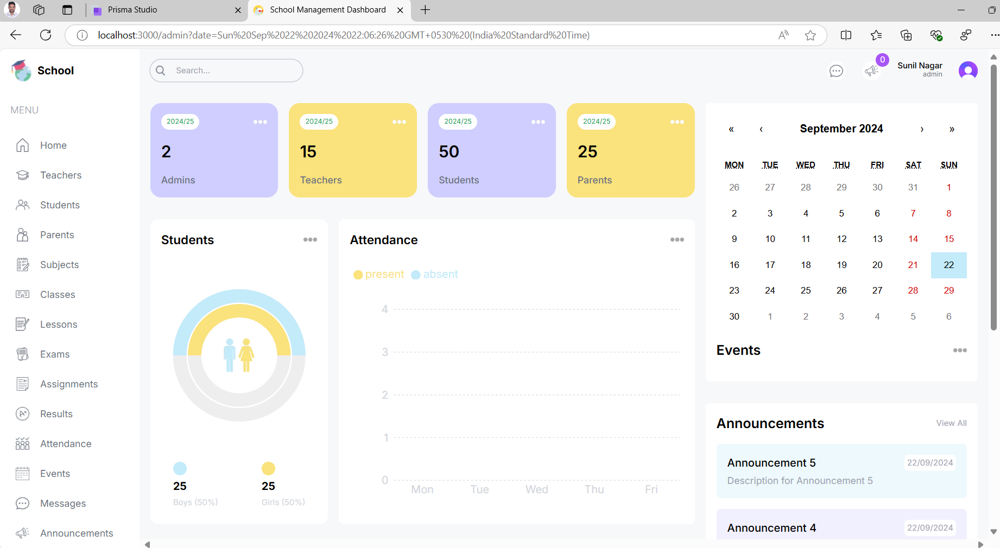

#  School Management Dashboard


## Getting Started

First, run the development server:

```bash
npm run dev
# or
yarn dev
# or
pnpm dev
# or
bun dev
```

Open [http://localhost:3000](http://localhost:3000) with your browser to see the result.

You can start editing the page by modifying `app/page.tsx`. The page auto-updates as you edit the file.

This Prisma schema defines a relational database structure for a school management system. Below is an explanation of the key components:

### Data Models

1. **Admin**:
   - Represents system administrators with unique usernames.

2. **Student**:
   - Stores information about students, including personal details (name, email, phone), relationships to parents, class and grade assignments, attendance records, and results for exams and assignments.

3. **Teacher**:
   - Contains details about teachers, including their subjects, classes, and personal information similar to students.

4. **Parent**:
   - Represents parents with their contact information and a relationship to their children (students).

5. **Grade**:
   - Represents academic grades (e.g., 1st grade, 2nd grade) with relationships to students and classes.

6. **Class**:
   - Defines classes (e.g., Class A, Class B), their capacity, the supervising teacher, and relationships to grades and lessons.

7. **Subject**:
   - Contains information about subjects taught in the school, linking them to teachers and lessons.

8. **Lesson**:
   - Represents individual lessons, including their schedule, subjects, and relationships to teachers, classes, and related assessments (exams and assignments).

9. **Exam**:
   - Contains details about exams, including scheduling and results linked to students.

10. **Assignment**:
    - Represents assignments given to students, with similar relationships to lessons and results.

11. **Result**:
    - Captures the scores obtained by students in exams and assignments.

12. **Attendance**:
    - Records attendance data for students in lessons, indicating whether they were present or not.

13. **Event**:
    - Represents events organized by the school, linked to specific classes.

14. **Announcement**:
    - Contains announcements made for classes, such as important dates or news.

### Enums

- **UserSex**: Defines gender options (MALE, FEMALE) for users.
- **Day**: Enumerates days of the week for scheduling lessons.

### Relationships

- **One-to-Many**: 
  - Parents can have multiple students.
  - Teachers can teach multiple subjects and have multiple lessons and classes.
  - Grades can encompass multiple classes and students.

- **Many-to-One**:
  - Each student, lesson, and attendance record is related to a single parent, teacher, or class.

### Features

- **Unique Constraints**: 
  - Several fields, like usernames and emails, have unique constraints to prevent duplicates.

- **Default Values**: 
  - Some fields, like `createdAt`, automatically set the current timestamp.

This schema provides a comprehensive foundation for managing school-related data, facilitating operations such as tracking student performance, managing class schedules, and handling parent-teacher communications.
